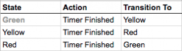
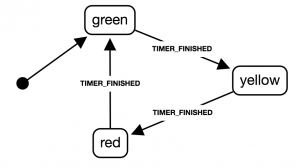

Have you ever thought that there’s something missing with how we manage state? We’ve got flux implementations like Redux and Vuex. They solve the big issue of how to maintain state across multiple components and provide an easy API to update it. But state management or the workflow of how a state can update is so project specific that flux doesn’t help. It doesn’t give us a manageable way to keep on top of how our state changes over time and what that means for our app.

When we start coding our app, we start from the bottom. Connecting a button click to a function, having the function call an API, updating a variable with the returned data and showing that new data in the UI. This workflow is stored in the developers head. Come back to the code in a month and that workflow is gone. We need a way to document this workflow.

## Finite State Machines

Finite State Machines (FSM) aren’t much more than a list of possible states and actions that allow states to transition from one to another. Luckily, this encompasses most of what a UI is, an element in a certain state (e.g. a button) and possible ways to update it (e.g. a click), which move it into a new state (the transition).

They’re an easy, high-level way of declaratively describing the behaviour of an application. The super simple example commonly used to describe a FSM is a traffic light system. The states of the traffic light system can be described in a table:



Or as a chart:



Each of the above contains the following elements:

* An initial state, in this case, Green
* A set of states the system can be in (Green, Yellow and Red)
* A set of actions to move the system to a new state (Timer Finished)

In the traffic light system, we start in Green. When the timer finishes, it fires an action letting the system know to move on. The system checks what the next state is and updates the state to that value. The system moves on when the next timer finishes.

See, pretty simple.

## xstate and Vue

How exactly do we represent a FSM in code? I’m going to use a library called [xstate](https://github.com/davidkpiano/xstate) which uses object notation to describe a state machine, in conjunction with Vuex.

Vuex is going to hold our transition function, which will update the current state and call any side effect actions, which will also be held as Vuex actions. When we want to change state, a dispatch will be made to the transition function with an action as a payload. The transition function will determine the next state based on the action and fire any side effects that are described in the state machine.

## The Machine

```javascript{numberLines: true}
import { Machine } from 'xstate';

const id = 'Fetch';

const fetchMachine = Machine({
    id,
    initial: 'idle',
    strict: true,
    states: {
        idle: {
            on: {
                FETCH_DATA_REQUEST: 'fetchingData'
            }
        },
        fetchingData: {
            onEntry: ['SHOW_LOADING', 'FETCH_DATA'],
            on: {
                SUCCESS: 'idle',
                FAILURE: 'fetchingData'
            },
            onExit: ['HIDE_LOADING']
        }
    }
});
```

Breaking the above down:

Line 6: The id is used by the transition function to update the correct state in Vuex.
Line 7: The starting point of our machine.
Line 8: This is a flag in xstate to provide more verbose warnings.
Line 9: The possible states our app can be in when fetching data.

Walking through the states, the following happens:

We start in idle, waiting for a dispatch request to fetch some data
In this state, if we receive the action FETCH_DATA_REQUEST, we will move the state on to fetchingData
When the state fetchingData is entered, the SHOW_LOADING and FETCH_DATA side effect actions are fired
If our request completes successfully and we receive the action SUCCESS, we will move the state back to idle, otherwise, the state will stay on fetchingData, to retry the request.

## The Transition

The transition is the key that binds all this together. The transitions will take in the machine, determine the nextState of the machine and fire any side effect actions in that next state. It looks like this:

```javascript{numberLines: true}
function transition(machine, { commit, state, dispatch }, { type, params, extState }) {
    const nextState = machine.transition(state.state, { type, params }, extState);

    commit(`update${machine.config.id}State`, nextState.value);

    nextState.actions.forEach(actionKey => {
        dispatch(actionKey, {
            type,
            params,
            history: nextState.history
        });
    });
}
```

Let’s break down this function down.

The function takes 3 inputs, the machine, the Vuex context object, and a payload. The context object and payload are destructured to pluck out only the things we need inside the function.

On line 2, we use the machine’s transition function to determine what the next state will be depending on the action (here called type), passing along the params and extState, the latter we don’t need to worry about at this point.

On line 4, we use the machine’s id (this will be ‘Fetch’) to commit a mutation which will update the current state to the value of the nextState.

Finally, on line 6, we loop through the side effects of the nextState and use Vuex to dispatch these, passing along the current type (action), params, and history of the past state.

## Vuex setup

Vuex will hold an action which will call the transition function (FETCH_TRANSITION), all other side effect actions and a mutation to update the current state (updateFetchState).

We need to bind the machine to the transition function, as it’s used by Vuex to pass along a context and payload.

```javascript{numberLines: true}
import { fetchMachine } from '@/js/vuex/fetchMachine';
import { transition } from '@/js/vuex/fsm-transition';

const state = {
    state: fetchMachine.initial,
    items: [],
    loading: false
};

const actions = {
    FETCH_TRANSITION: transition.bind(null, fetchMachine),
    FETCH_DATA({ commit, dispatch }, { params: { query } }) {
        setTimeout(() => {
            commit('updateItems', ['cat', 'dog', 'fish']);
            dispatch('FETCH_TRANSITION', {
                type: 'SUCCESS'
            });
        }, 2000);
    },
    SHOW_LOADING({ commit }) {
        commit('loading', true);
    },
    HIDE_LOADING({ commit }) {
        commit('loading', false);
    }
};

const mutations = {
    updateFetchState(state, nextState) {
        state.state = nextState;
    },
    updateItems(state, data) {
        state.items = data;
    },
    loading(state, payload) {
        state.loading = payload;
    }
};

new Vuex.Store({
    state,
    actions,
    mutations
});
```

Putting this all together, we get the following. When the FETCH DATA button is clicked, the current state will be updated, fetching some items and changing the Loading flag to true. When the fetch is complete (in this case it’s just a timeout), we will dispatch a SUCCESS action to move the state back to idle and turn the Loading flag back to false.

## Takeaways

This may seem like a lot of work to get set up. But now we’ve got this model in place, once the app starts to scale, management of the state becomes completely declarative. Now we can easily change our application logic by rearranging what a state can transition to. New behaviour can be added by adding new states and because of this declarative approach, it’s easy to reuse side effects. Our loading action can be added to any state that needs it.

The main benefit, however, is that now we have a form of documentation on how our app works internally. Before, all this intrinsic functionality had to be kept inside the developers head. Now any new developer can simply look through the machine to see how the app functions.

I’ve used this approach in a side project app called [Minipops](https://minipops.co.uk/), with great results. The app uses FSM for things like subscribing to push notifications and logging a user in. Check out the [Github](https://github.com/Sound1ab/Minipops) repo to see my workings. The state machines can be found in the folder ‘src/js/vuex/FSM’.

## Where to go from here?

Although I’ve been referring to this model as a Finite State Machine. The library xstate actually uses what’s called Statecharts. Statecharts are Finite State Machines but with some helpful enhancements that make them more suitable for this kind of work (hierarchical and parallel machines, guards etc).

I’d advise delving into the world of statecharts. Check out the xstate docs for more info on what xstate can do and have a read through some of the following resources I found super useful when getting into Finite State Machines!

* [You are managing state? Think twice.](https://krasimirtsonev.com/blog/article/managing-state-in-javascript-with-state-machines-stent)
* [David Khourshid – Infinitely Better UIs with Finite Automata](https://www.youtube.com/watch?v=VU1NKX6Qkxc)
* [Robust React User Interfaces with Finite State Machines](https://css-tricks.com/robust-react-user-interfaces-with-finite-state-machines/)
* [The (unfinished) world of Statecharts](https://statecharts.github.io/)
* [STATECHARTS: A VISUAL FORMALISM FOR COMPLEX SYSTEMS](https://www.inf.ed.ac.uk/teaching/courses/seoc/2005_2006/resources/statecharts.pdf)