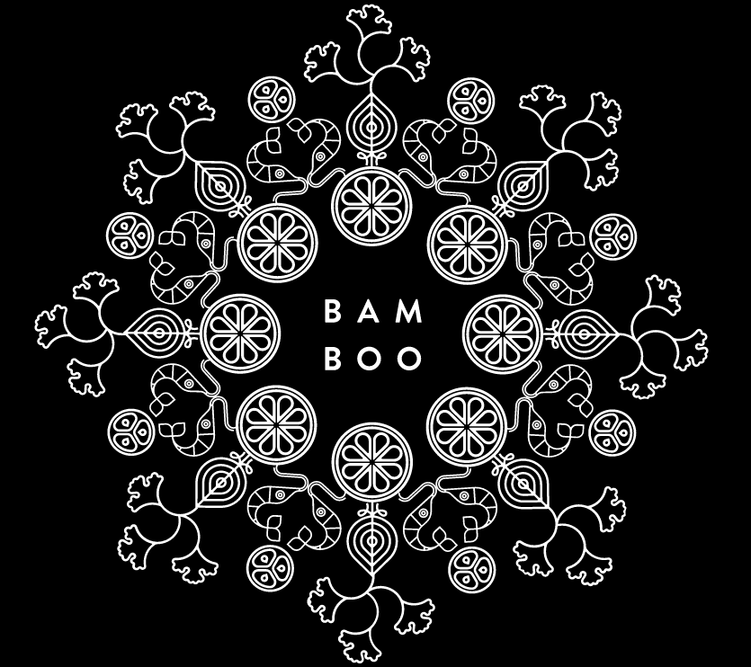

BamBoo is a London restaurant specilising in bao buns. The project was built using React and Gatsby along with Styled components, TypeScript, GraphQL and atomic design

All content on the site is dynamically generated using [Contentful's](https://www.contentful.com/) powerful model
based API system. This content is pulled into the site at compile time and
therefore the site must be rebuilt whenever changes to the content are made. To perform the regeneration, an
automatic webhook is setup that will trigger a rebuild on CirleCI whenever changes are published on Contentful. 

[Take a look.](http://bamboo-master.s3-website.eu-west-2.amazonaws.com/)
