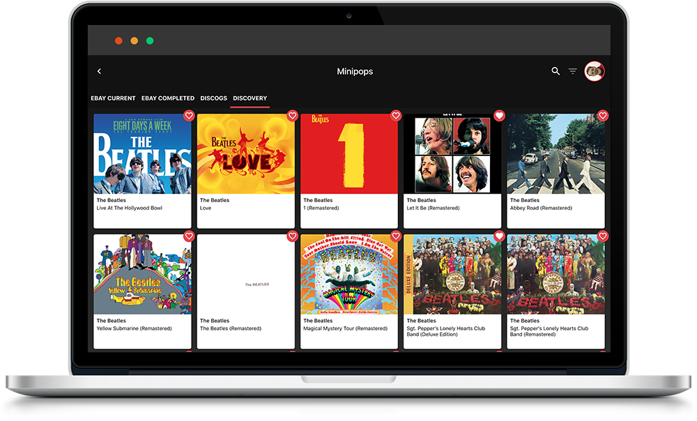
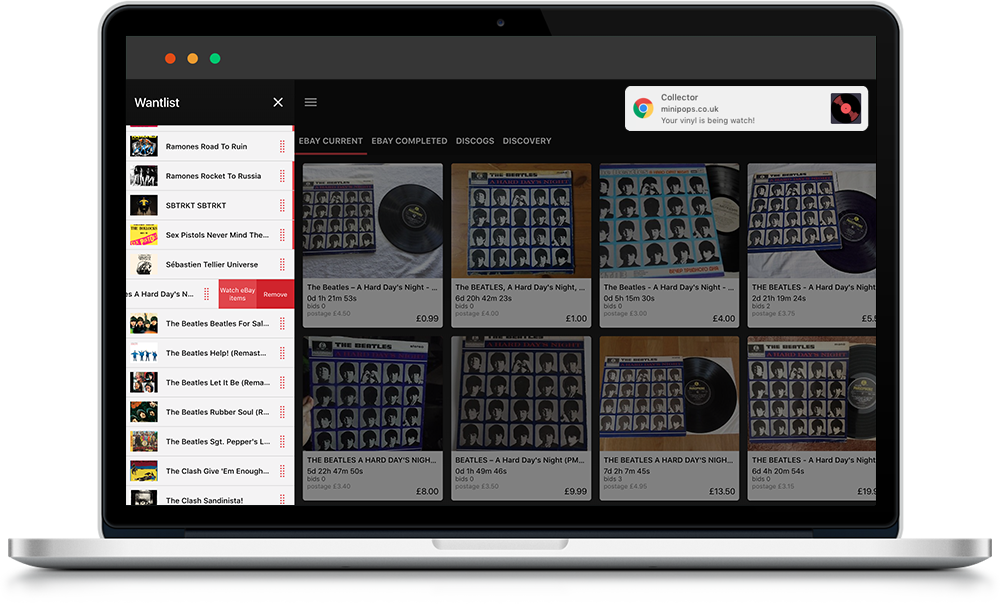

# Minipops

Get updates on vinyl items selling on eBay and bag yourself a bargain.

Minipops is a progressive web app that lets you build a list of your most sought-after vinyl and attach eBay watchers to them to easily receive updates on items that are about to sell.

The app uses a combination of AWS lambda functions, AWS CloudWatch and Node.js to continually check eBay for selling items. If it finds one, a push notification is sent directly to your computer or Android device to let you know with an easily accessible link.

To aid discovery, Minipops utilises the Spotify API to show a list of artists related to your search.

Each user is setup with their own personal account, managed using AWS Cognito. This allows each user to login from any device and manage their wantlist and personal account information.