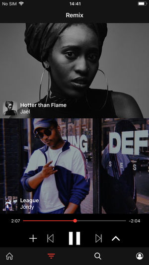

# BamBoo

[Take a look.](https://itunes.apple.com/us/app/ossia/id1317859971)

Explore new artists and create your own remixes of their songs by combining different vocals and backing tracks with a simple swipe.

Worked as part of a team to create the iPhone app, Ossia. The project utilised React Native, Superpowered, GraphQL and ArangoDB to allow users to easily generate remixes by mixing different vocal and backing tracks. Users can save remixes to their library and explore chill out, party and workout remixes of each track already created.